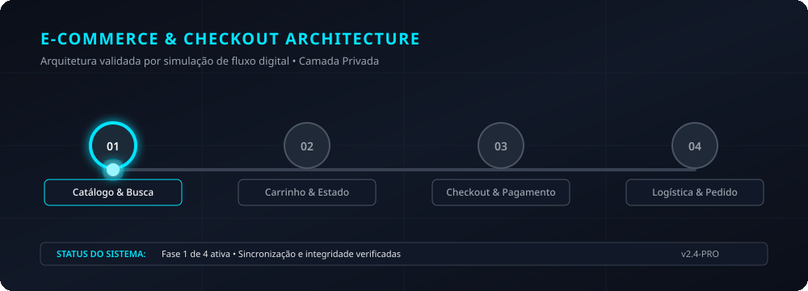

# Planejamento: configuração inicial de loja em plataforma hospedada

> **Status:** planejamento privado. Sem catálogo, imagens, credenciais ou marca de terceiros.

## Objetivo

Organizar a configuração de uma pequena loja virtual em plataforma hospedada, com foco em catálogo, navegação e preparação para operação do proprietário.

## Requisitos

| Componente | Planejamento |
|---|---|
| Catálogo | Estrutura de categorias, produtos, variações e imagens fornecidas. |
| Navegação | Menu, busca, páginas institucionais e políticas do lojista. |
| Conversão | Página de produto, carrinho e chamadas de ação claras. |
| Entrega | Treinamento de atualização e checklist de publicação. |

## Fora do escopo inicial

Cadastro em meios de pagamento, logística, compra de domínio, copy comercial e operação de anúncios dependem de informações e decisões do proprietário.
